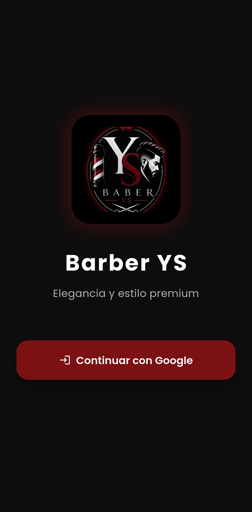

# Barber YS

Aplicación móvil desarrollada en Flutter para la administración de una barbería moderna.  
Permite a los clientes agendar citas y visualizar trabajos realizados, mientras que los administradores pueden gestionar publicaciones, imágenes y citas.

---

# Vista previa



---

# Características principales

## 👤 Clientes
- Inicio de sesión con Google
- Inicio de sesión con huella digital
- Agendar citas
- Ver únicamente sus propias citas
- Visualizar cortes publicados
- Cambiar foto de perfil
- Ver información y redes sociales de la barbería

---

## 🧑‍💼 Administrador
- Gestión de citas
- Publicación de cortes y trabajos
- Subir imágenes desde galería o cámara
- Eliminar publicaciones
- Panel administrativo

---

# 🎨 Diseño
La aplicación cuenta con una interfaz moderna y elegante utilizando los colores:
- Guindo
- Negro
- Blanco

Además incluye:
- Animaciones suaves
- Diseño responsive
- Cards modernas
- Pantallas premium

---

# 🛠️ Tecnologías utilizadas

- Flutter
- Dart
- Provider
- Shared Preferences
- Firebase Authentication
- Google Sign-In
- Local Authentication
- Image Picker
- WebView Flutter
- URL Launcher
- Google Fonts
- Flutter Animate

---

# 🔐 Funcionalidades de autenticación

- Inicio de sesión con Google
- Validación de administrador
- Persistencia de sesión
- Autenticación biométrica (huella)

---

# 📸 Gestión de imágenes

Los administradores pueden:
- Tomar fotografías
- Seleccionar imágenes desde la galería
- Publicar cortes realizados

Los clientes pueden:
- Visualizar publicaciones
- Ver descripciones de cada corte

---

# 🌐 Redes sociales y contacto

La aplicación incluye:
- WhatsApp
- Google Maps
- Instagram
- Facebook
- TikTok

Utilizando:
- `url_launcher`
- `webview_flutter`

---

# 💾 Persistencia de datos

Se utiliza `SharedPreferences` para:
- Guardar citas
- Mantener fotos de perfil
- Guardar publicaciones
- Persistencia local de datos

---

# Instalación

## 1. Clonar repositorio

```bash
git clone https://github.com/sustaitamaria2008-coder/Barber-YS.git
```

---

## 2. Instalar dependencias

```bash
flutter pub get
```

---

## 3. Ejecutar aplicación

```bash
flutter run
```

---

# 📂 Estructura del proyecto

```text
lib/
 ├── models/
 ├── providers/
 ├── screens/
 ├── widgets/
 ├── services/
 └── main.dart
```

---

# 👨‍💻 Desarrollado por

**Maria Sustaita**  
Proyecto desarrollado con Flutter para administración de barbería móvil.